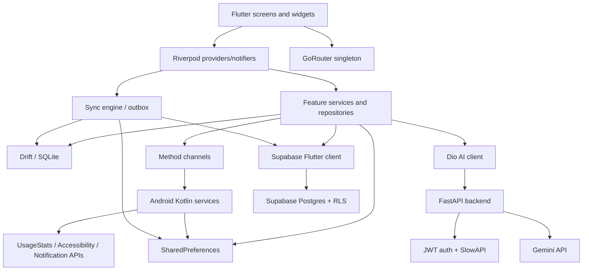
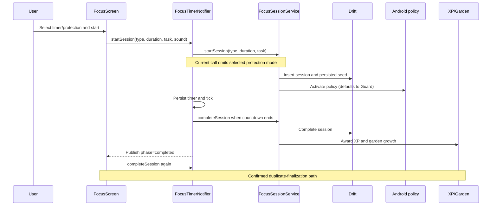
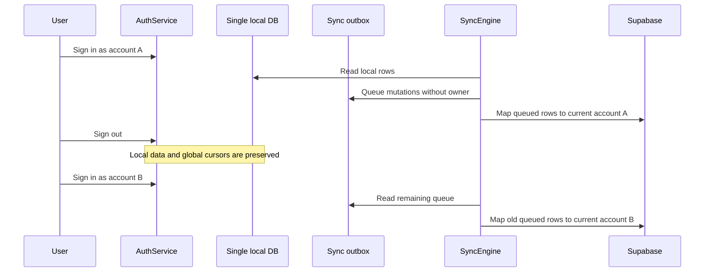

# FlowOS Repository Map

Audit snapshot: 2026-07-27, revision `d61394c` plus pre-existing working-tree changes.

## Top-level map

```text
flowos/
├── lib/                         Flutter application (about 32.5k non-generated Dart LOC)
│   ├── main.dart                bootstrap, notifications, preferences, Supabase, Sentry
│   ├── core/                    theme, configuration, constants, shared services
│   ├── data/local/              Drift database, 18 tables, DAOs, generated code
│   ├── features/                auth, attention, focus, garden, sync, reports, XP, etc.
│   └── presentation/            router, primary screens, shared presentation widgets
├── test/                        31 Dart test files plus two ignored 238 MB APK artifacts
├── android/                     Kotlin bridges/services and Gradle release configuration
├── ios/                         iOS Runner configuration
├── backend/                     FastAPI/Gemini service and Python tests
├── supabase/migrations/         cloud schema, RLS policies, sync-related migrations
├── flowos-extension/            Chrome Manifest V3 extension
├── assets/                      sounds, images, animations, data, and 70 font files
├── docs/                        product, architecture, implementation, and policy documents
└── .github/workflows/           Flutter analyze/test CI
```

No Flutter `web/`, `macos/`, `windows/`, or `linux/` platform folders exist. The supported Flutter targets in this repository are Android and iOS.

## Application entry points

| Entry point | Responsibility | Centrality/risk |
|---|---|---|
| `lib/main.dart` | Framework error hook, notification initialization and schedules, preferences, database-existence check, device ID, Supabase, Sentry, root app | High; performs serial work before `runApp` |
| `lib/presentation/navigation/app_router.dart` | GoRouter routes, onboarding redirect, auth refresh listener, shell navigation | High; global mutable onboarding state and global auth listener |
| `lib/data/local/database/app_database.dart` | Drift schema v9, 18 tables, migrations, full local-data deletion | Critical; upgrade and data-retention boundary |
| `lib/features/focus/providers/focus_timer_provider.dart` | Persisted timer state, lifecycle catch-up, policy lease, completion, sync trigger | Critical; primary focus source of truth |
| `lib/features/sync/services/sync_engine.dart` | cursor-based pull, outbox push, conflict resolution, timer scheduling | Critical; cloud consistency and account boundary |
| `android/app/src/main/kotlin/com/flowos/flowos/MainActivity.kt` | method-channel permissions, app list/icons, usage/unlock queries, policy/nudge bridge | High; mobile platform boundary |
| `android/app/src/main/kotlin/com/flowos/flowos/FocusBlockerService.kt` | accessibility interception and policy enforcement | Critical; app-protection promise and hot path |
| `backend/main.py` | FastAPI middleware, CORS, limiter, routes | Critical; public API boundary |
| `backend/routers/ai.py` | authenticated/rate-limited Gemini endpoints | Critical; cost and user-data boundary |

## Major Flutter modules

| Module | Representative files | Role |
|---|---|---|
| Authentication | `lib/features/auth/services/auth_service.dart` | Supabase email/OAuth/reset/sign-out and Riverpod auth providers |
| Attention data | `lib/features/attention/repository/attention_data_repository.dart`, platform bridge | Usage, unlock, notification coverage and data prioritization |
| App protection | `lib/features/focus/services/protection_policy_service.dart`, policy writers, picker UI | Persist protected apps and activate Android policies |
| Focus | timer provider, session service, focus/deep-work screens, audio player | Session lifecycle, audio, XP, garden seed, break and shield behavior |
| Garden | `lib/features/flow_garden/services/garden_service.dart`, painters/widgets | Derive today/week garden from sessions and attention/care activity |
| Tasks and plans | Drift DAOs and task/morning-intention screens | Task mutation, MIT planning, completion |
| Insights/reports | daily score, history aggregator, action engines, report screens | Derived productivity scores and summaries |
| Sleep | sleep schedule table/service/screen and native policy | Scheduled protection windows |
| Sync | providers, outbox DAO/table, engine, cloud mappers | Optional multi-device Supabase synchronization |
| Export | `lib/features/export/services/data_export_service.dart` | Serialize and share a partial local-data snapshot |
| Notifications | `lib/features/notifications/services/notification_service.dart` | Local reminder scheduling |
| XP/profile | XP calculator/ledger, streaks, achievements, profile UI | Append-only progression and user-facing stats |

## State management and dependency injection

Riverpod is the primary state-management and dependency-injection mechanism. Providers expose the Drift database, DAOs/services, timer state, auth state, sync engine, settings, theme, and feature data. GoRouter is a module-level singleton rather than provider-owned.

Important ownership observations:

- `focusTimerNotifierProvider` is intended to be the single active timer source of truth.
- focus and deep-work screens nevertheless own completion side effects and call completion again after the notifier publishes `completed`.
- `authStateProvider` is reactive, while `currentUserProvider` reads `Supabase.instance.client.auth.currentUser` without depending on that stream.
- router onboarding state is a mutable module global.
- some screens instantiate transport services directly, notably `AiService`, reducing testability and preventing token injection.

## Persistence map

The Drift database contains:

- tasks;
- focus sessions;
- XP ledger;
- attention costs;
- scroll logs;
- energy check-ins;
- daily plans and reports;
- achievements;
- device usage records;
- unlock attempts;
- protected apps;
- daily device metrics;
- sleep schedules;
- notification counts and processed batches;
- daily scores;
- sync outbox.

SharedPreferences separately stores onboarding/profile/settings, active timer state, Android policy JSON, sleep configuration, nudge/trigger state, sync cursors, sync timestamps, and device identity. Supabase stores the cloud-synchronized subset and protects it with per-user RLS policies.

## Dependency graph



## Representative focus-session flow



## Authentication and sync flow



Cloud RLS limits access to `auth.uid() = user_id`, but it cannot correct a client that labels another local user's queued row with the current user's ID.

## Navigation overview

`app_router.dart` defines onboarding, auth, home shell, focus/deep work, tasks, profile, garden, insights/reports, sleep/device setup, settings, breaks, and utility routes. A shell provides Home, Tasks, Focus, and Profile tabs. Redirect decisions combine:

- a module-global `onboardingComplete`;
- current Supabase session state;
- special allow-listed onboarding/auth/setup routes.

Auth OAuth/reset callbacks target `io.supabase.flowos://login-callback/`, but neither mobile platform registers that callback in the audited snapshot.

## External integrations

| Integration | Use | Current concern |
|---|---|---|
| Supabase Auth | optional email/OAuth accounts | callback scheme absent; local account boundary absent |
| Supabase Postgres | multi-device synchronization | RLS present; client account ownership/cursors unsafe |
| Gemini via FastAPI | reports, breaks, brain dump, weekly review | server auth bypass; Flutter client sends no bearer token |
| Android UsageStats | screen-time history | permission-dependent; Android only |
| Android Accessibility | foreground app protection | cached/backgrounded; device/OEM testing still required |
| Android notification listener | per-app notification metrics | privacy/coverage and device validation required |
| Local notifications | check-ins and reminders | local timezone is forced to UTC |
| Sentry | optional crash reporting | framework errors only; disabled without DSN |
| Chrome extension | browsing protection | account/linking behavior not covered by mobile tests |

## High-centrality and high-risk files

| File | Approx. lines | Why it matters |
|---|---:|---|
| `lib/presentation/screens/settings/settings_screen.dart` | 1,134 | account, data deletion/export, permissions, preferences |
| `lib/presentation/screens/focus/focus_screen.dart` | 968 | timer UI plus lifecycle, audio, completion, routing |
| `lib/features/focus/providers/focus_timer_provider.dart` | 583 | persisted focus state machine and native policy lease |
| `lib/features/sync/services/sync_engine.dart` | substantial | every cloud table, cursors, conflicts, outbox |
| `lib/data/local/database/app_database.dart` | central | all local data and every migration |
| `lib/features/attention/repository/attention_data_repository.dart` | 545 | platform/data coverage and attention truth |
| `android/.../FocusBlockerService.kt` | central | accessibility hot path and enforcement |
| `android/.../MainActivity.kt` | central | broad method-channel surface |
| `backend/services/limiter.py` and `auth_service.py` | small/critical | public authentication boundary |

Other large screens include Scroll Tracker (808), Insights (776), Home (610), Tasks (616), onboarding connect (609), reports (about 600 each), morning intention (593), sleep mode (571), and deep work (564). Size alone is not a defect; the concern is their mixed ownership of UI, navigation, asynchronous effects, and business coordination.

