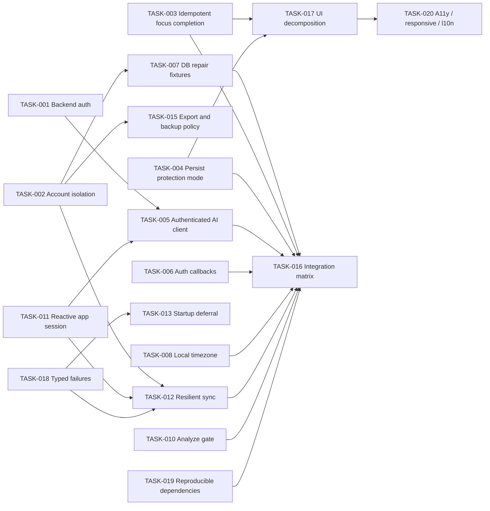

# FlowOS Implementation Roadmap

This roadmap resolves trust and data-integrity boundaries before feature expansion or broad UI work. Task definitions and acceptance criteria are in [task backlog](04-task-backlog.md).

## Sequencing principles

1. Freeze production release work until the two S0 boundaries are closed.
2. Do not refactor focus UI before completion ownership and protection state are corrected.
3. Do not harden sync around the current model before choosing an account-isolation model.
4. Preserve user data through database and account migrations; never use silent clearing as the default recovery.
5. Build focused regression tests with each fix, then add platform smoke coverage.
6. Every task, including Flash or external-input work, receives final `REASONING_MODEL` verification.

## Phase 0 — Release blockers and security

### TASK-001 — Repair backend authentication and rate-limit identity

Remove the forged-identity path immediately. This task can begin independently and blocks AI client release.

### TASK-002 — Establish account ownership and isolation

Choose and implement the local profile/account model, then migrate the database, outbox, and cursors. During this work, disable cross-account sync rather than risk misattribution.

### TASK-009 — Make Android release signing fail closed

Remove the debug fallback immediately. Production signing credentials and Play Console configuration require authorized human input.

### TASK-007 — Build the installed-database repair path

Capture affected schema shapes before modifying migrations. The repair can proceed in parallel with backend work but should coordinate with account-ownership schema changes.

### TASK-006 — Complete mobile auth callback routing

Repository changes can proceed while Supabase/Google/Apple dashboard configuration is gathered. Do not claim completion without device callback tests.

**Phase 0 exit:** forged tokens fail; two accounts cannot cross-read or cross-upload; release cannot use a debug key; supported installed databases upgrade without data loss; supported auth callbacks return to the app.

## Phase 1 — Correctness and reliability

### TASK-003 — Make focus completion single-owner and idempotent

This is the highest-value product correctness fix. It owns the domain mutation; UI becomes a consumer of a one-shot result.

### TASK-004 — Persist and honor focus-protection strictness

Add protection mode to the session state machine after agreeing on persistence compatibility. Coordinate with TASK-003 because both change timer state and tests.

### TASK-005 — Implement the authenticated AI client contract

Depends on TASK-001 and the reactive auth foundation from TASK-011, or uses a small approved interim token provider. Offline/local-only UI must be explicit.

### TASK-008 — Schedule reminders in the device timezone

This can run independently of focus and sync once a timezone source is selected.

### TASK-010 — Restore a meaningful static-analysis gate

Fix the enum/string defect and direct dependency declarations first. Clean remaining warnings in bounded slices without suppressing categories.

**Phase 1 exit:** one focus session produces one completion and the selected policy; AI availability/auth behavior is coherent; local reminders match local time; `flutter analyze` passes.

## Phase 2 — Architectural foundations

### TASK-011 — Consolidate auth, onboarding, and router session state

Provide one reactive source for user/session/onboarding readiness. This reduces the risk in AI and sync lifecycle work.

### TASK-012 — Make sync account-bound, cancellable, and resilient

Depends on TASK-002 and TASK-011. Add serialization, cancellation, retry classification, durable cursor semantics, and actionable progress.

### TASK-018 — Introduce typed failures and structured observability

Define boundary errors and redacted diagnostics before optimizing startup and platform work. This task may start with an error taxonomy in parallel with TASK-011.

### TASK-017 — Decompose focus and settings presentation by responsibility

Starts only after TASK-003 and TASK-004 settle state ownership. Extract pure widgets first; do not redesign all screens at once.

**Phase 2 exit:** account/auth transitions drive router and sync predictably, failures are diagnosable, and critical screens no longer own duplicate domain mutations.

## Phase 3 — Performance and UX

### TASK-013 — Move noncritical work off the first-frame path

Instrument first, then defer notification maintenance and other nonessential setup. Preserve local-first startup during backend/plugin failure.

### TASK-014 — Coalesce and batch garden aggregation

Measure event and query counts, share derived streams, and prevent stale async emissions.

### TASK-015 — Define safe export/backup and Android restore behavior

Depends on the ownership model from TASK-002 and privacy/product decisions. Correct labeling can ship before a full restore feature.

### TASK-019 — Restore dependency reproducibility and trim proven waste

Commit the application lockfile, move APK artifacts out of the test tree, then remove only verified-unused dependencies/assets against a size baseline.

**Phase 3 exit:** first-frame and garden pipelines are measured and bounded; export/backup claims match reality; dependency resolution is reproducible.

## Phase 4 — Testing and observability

### TASK-016 — Add a high-value cross-layer regression matrix

Unit/contract tests are delivered with their fixes. This phase adds reusable upgrade fixtures, backend endpoint auth, account-switch/sync, focus widget/notifier, auth-routing, and Android device smoke coverage.

TASK-016 overlaps earlier phases intentionally: its harness can start early, but it closes only when the fixed production flows are exercised end to end.

**Phase 4 exit:** CI protects core Dart/backend behavior and the release checklist records physical-device results for platform-only flows.

## Phase 5 — Feature opportunities and cleanup

### TASK-020 — Establish accessibility, responsive, and localization baselines

After critical UI boundaries stabilize, cover shared navigation, focus, onboarding, tasks, settings, and garden at larger text sizes and supported device classes. Product/design must choose language scope.

Feature work should then follow [feature opportunities](05-feature-opportunities.md), beginning with permission health and sync/support transparency rather than a second gamification system.

## Dependency graph

No dependency requires a later cleanup task to unblock an S0 fix. TASK-001, TASK-002 discovery/design, TASK-003, TASK-008, TASK-009, and TASK-010 can start in parallel if their files are isolated. TASK-003 and TASK-004 should be coordinated because both modify the timer state. TASK-002 and TASK-007 should agree on schema order before either migration is finalized.

## Recommended first implementation batch

| Order | Task | Executor | Parallelism |
|---:|---|---|---|
| 1 | TASK-001 backend authentication | REASONING_MODEL | Independent |
| 1 | TASK-009 release-signing guard | HUMAN_OR_EXTERNAL_INPUT, then code review | Independent |
| 1 | TASK-002 account-isolation design and containment | REASONING_MODEL | Design can run independently; migration coordinates with TASK-007 |
| 1 | TASK-003 focus completion idempotency | REASONING_MODEL | Parallel with backend/account work |
| 1 | TASK-010 analyzer correctness baseline | REASONING_MODEL | Parallel if it avoids focus files under active change |
| 2 | TASK-004 protection-mode persistence | REASONING_MODEL | After/with TASK-003 |
| 2 | TASK-007 migration repair | REASONING_MODEL | After schema ownership decision |

This first batch reduces active exposure and restores trust in the app's main action before visual or feature expansion.

